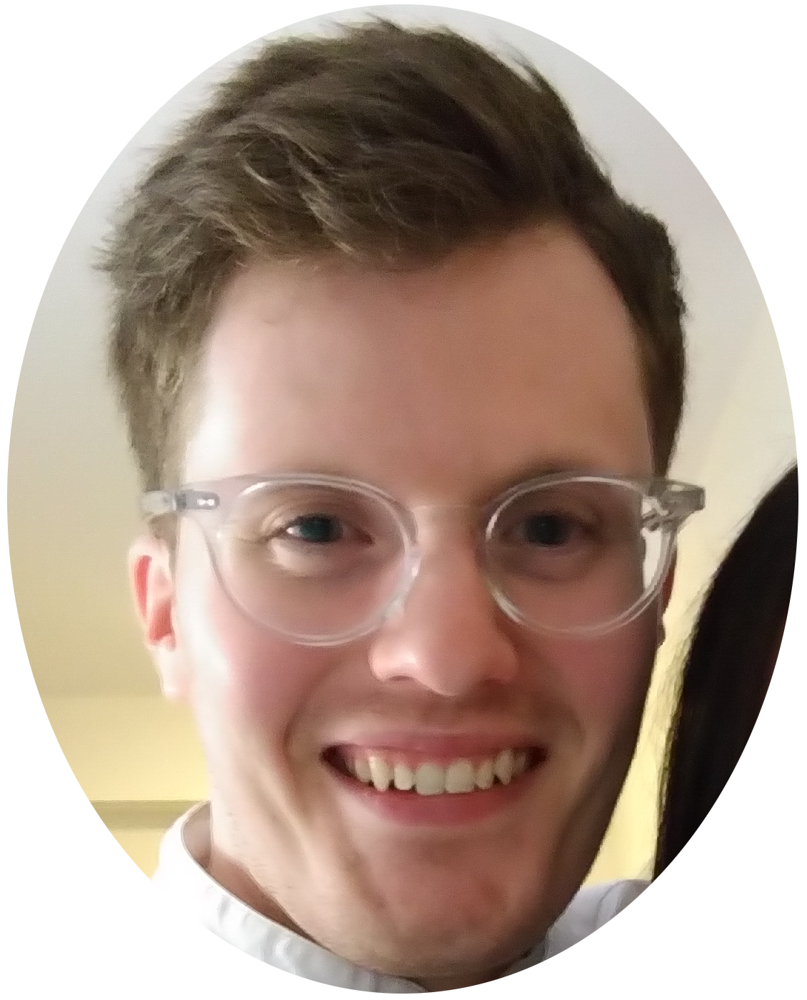

  

After trying for a baby for one year, I found out that I was infertile in 2019. I have azoospermia, which means I don’t produce any sperm. My life changed forever the day I found out I am infertile. It affected how I thought about myself, what I saw when I looked in the mirror. It affected my mental health. It made me question, “Am I a man?”.

Since my diagnosis, we’ve had many meetings, loads of tests, some counselling, and decided to use a sperm donor to help us conceive. Soon we’ll start the gruelling challenge that is IVF. It’s been overwhelming and alienating, and I know we’ve got more tough times ahead. But I try to take life’s difficult experiences and find something positive in them.

People need support dealing with infertility. I don't think society is used to the idea of men being infertile, let alone men struggling with infertility. Us guys need to know there are others going through it who understand. So I shared my story online, where I found the support I needed and could support others too. In the spirit of being supportive and raising awareness, I'm starting a podcast about male infertility: The No Swim Zone. The podcasts I listen to have really helped me deal with my infertility, hopefully I can be that for others.

If you want to talk about the podcast, join me for a chat on a podcast episode, or talk about anything else, feel free to [drop me an email](mailto:sean.noswimzone@gmail.com).
